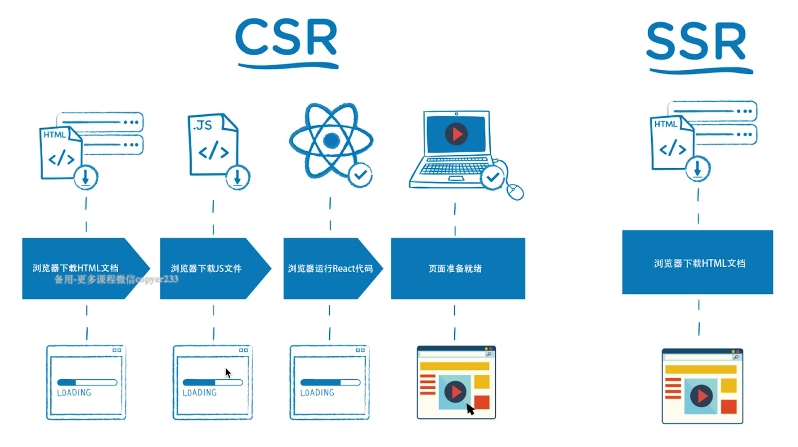
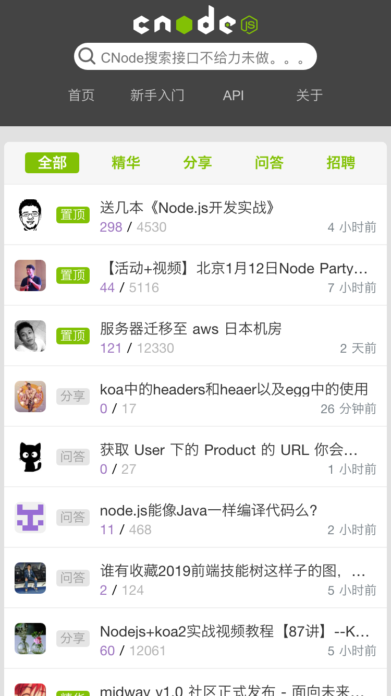
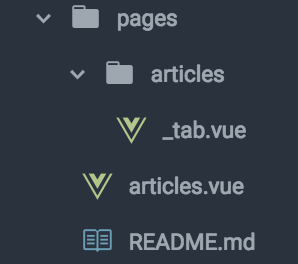
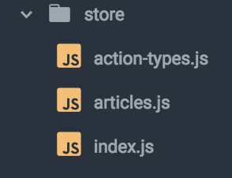
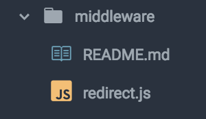
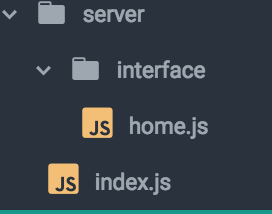

# 服务端渲染(SSR)

> SSR意为 server-side rendering（服务端渲染）,目的是为了解决单页面应用的SEO的问题。

## 服务器端渲染(SSR)和客户端渲染(CSR)

<!---->


### 服务器端渲染(SSR)
 浏览器先请求HTML文档，服务器端先将html页面(或页面组件)，生成为html字符串，再返回给浏览器，最后直接渲染到页面上。

### 客户端渲染(CSR)
  浏览器先请求HTML文档，在浏览器端加载html页面中的JS脚本。通过JS（vue/react)的能力，将虚拟DOM最终渲染填充到页面中。

### 两者本质的区别是什么？

#### SSR
服务端生成好的html页面内容，直接返回给浏览器渲染。

server

```
const express = require('express')

const app = express()

app.get('/ssr', (req, res) => {
  res.send(`
    <html>
      <head>
        <meta charset='utf-8'>
        <title>SSR 服务端渲染</title>
      </head>
      <body>
        <h3>SSR 服务端渲染</h3>
        <p>SSR意为 Server Side Rendering（服务端渲染）,目的是为了解决单页面应用的SEO的问题。</p>
      </body>
    </html>
  `)
})

app.listen(7200)
```

客户端访问页面localhost:7200/ssr
```
   <html>
      <head>
        <meta charset='utf-8'>
        <title>SSR 服务端渲染</title>
      </head>
      <body>
        <h3>SSR 服务端渲染</h3>
        <p>SSR意为 Server Side Rendering（服务端渲染）,目的是为了解决单页面应用的SEO的问题。</p>
      </body>
    </html>
```

#### CSR 
页面首先直接输出一个空的div#root，再由客户端加载编译打包好的react代码（bundle.js chunk.js等js脚本），最终将页面组件渲染到页面中。

```
npx create-react-app my-app
cd my-app
yarn start
```

浏览器访问http://localhost:3000/ 
```
  <body>
    <noscript>You need to enable JavaScript to run this app.</noscript>
    <div id="root"></div>
  <script src="/static/js/bundle.js"></script><script src="/static/js/0.chunk.js"></script><script src="/static/js/main.chunk.js"></script></body>
```

客户端渲染和服务器端渲染的最重要的区别就是究竟是谁来完成html文件的完整拼接，如果是在服务器端完成的，然后返回给客户端，就是服务器端渲染，而如果是前端做了更多的工作完成了html的拼接，则就是客户端渲染。

#### 前后端拆分核心理念
前后端拆分，后端专注于数据接口服务，前端专注接口调用，页面渲染，双剑合璧，相得益彰。

#### 服务器端渲染的优缺点是怎样的？
优点：
  
  - **更好的SEO 首屏加载快** 
   由于搜索引擎爬虫抓取工具可以直接查看完全渲染的页面。
  - **首屏加载快** 
    快速地看到完整渲染的页面，从而提高用户体验。
  - **后端生成静态化文件** 
    即解析模板的工作完全交由后端来做，客户端只要解析标准的html页面即可。

缺点：
  - **开发条件受限**
  在服务端渲染中，created和beforeCreate之外的生命周期钩子不可用
  - **占用服务端资源**
  - **学习成本相对较高** 
  除了对webpack、Vue要熟悉，还需要掌握node、Express相关技术。相对于客户端渲染，项目构建、部署过程更加复杂。

#### 客户端渲染的优缺点是怎样的？
优点：　　
  - **前后端分离** 
  前端专注于前端UI，后端专注于api开发，且前端有更多的选择性，而不需要遵循后端特定的模板。
  - **体验更好**

缺点：
  - **首屏加载缓慢** 
  - **不利于SEO** 
  除了 Google 和 Bing 比较完美地实现了对于 SPA（Single-Page Application）的爬虫渲染及内容抓取，大多数搜索引擎包括百度都没有支持。因而，包含丰富内容的产品并需要 SEO 流量的产品也就自然需要 SSR 实现。

### 是否应该使用服务端渲染

 - **首屏加载慢**
针对于首屏加载，可以做服务端渲染。但要有觉悟，一旦这样做，后期维护是个很痛苦的事情。相比于做服务端渲染，更推荐通过应用拆分、code spliting 来完成优化首屏加载的过程（先前做过一次首屏优化，优化前首屏加载每次都在 5s+，code spliting 之后直接变成 2s+，性价比高）。
- **SEO优化**
如果是为了主页网站被搜索引擎收录，可以使用服务端渲染。但更好的建议新开引导项目，在该项目上静态资源或服务端渲染显示页面，作为主要网站的搜索引擎引流作用。

## Vue服务端渲染
 这里我们先从Vue的vue-server-renderer来聊聊服务端渲染，暂先不说那些ssr框架（Nuxt.js Next.js)
 vue-server-renderer 是官方提供给我们用来实现服务端渲染的npm包
### 基本用法
安装
```
npm install vue vue-server-renderer --save
```

### 渲染一个Vue实例

1.创建一个 Vue 实例

```
const Vue = require('vue')

const app = new Vue({
  template: `<div>hello zhufeng</div>`
})
```

2.创建一个 renderer对象

```
const renderer = require('vue-server-renderer').createRenderer()
```

3.将 Vue 实例渲染为 HTML

```
renderer.renderToString(app, (err, html) => {
  if (err) throw err
  console.log(html)
  // <div data-server-rendered="true">hello zhufeng</div>

})

// 在 2.5.0+，如果没有传入回调函数，则会返回 Promise：
renderer.renderToString(app).then(html => {
  console.log(html)
}).catch(err => {
  console.error(err)
})
```

#### Vue实例渲染 完整示例代码

Node.js 服务器作为中间层

```
npm i express --save
```

```
const Vue = require('vue')
const server = require('express')()
// 创建一个 renderer对象
const renderer = require('vue-server-renderer').createRenderer()

// 创建一个后端路由
server.get('/', (req, res) => {
  // 创建一个 Vue 实例
  const app = new Vue({
    data: {
      title: 'hello zhufeng'
    },
    template: `<h3>{{ title }}</h3>`
  })

  // 通过renderToString方法 将Vue实例转换成HTML
  renderer
    .renderToString(app)
    .then(html => {
      console.log(html) 
      // '<h3 data-server-rendered="true">hello zhufeng</h3>'

      // 最终将拼接好的html页面内容 返回给浏览器
      res.send(`
        <!DOCTYPE html>
        <html lang="en">
          <head><title>Hello</title></head>
          <body>${html}</body>
        </html>
      `)
    })
    .catch(err => {
      res.status(500).end('Internal Server Error')
    })
})

server.listen(7300)

```

#### 使用html页面模板
创建一个html模板页面，用一个额外的HTML页面包裹容器，来包裹生成的HTML标记(markup)。

html模板
```
<!DOCTYPE html>
<html lang="en">
<head>
  <meta charset="UTF-8">
  <meta name="viewport" content="width=device-width, initial-scale=1.0">
  <meta http-equiv="X-UA-Compatible" content="ie=edge">
  <title>服务端渲染SSR</title>
</head>
<body>
  <!--vue-ssr-outlet-->
</body>
</html>

```
 > 注意 \<!--vue-ssr-outlet--> 注释 -- 这里将是应用程序 HTML 标记注入的地方。

server端
```
const Vue = require('vue')
const fs = require('fs')
const server = require('express')()

const { createRenderer } = require('vue-server-renderer')

// 创建一个 renderer对象 并指定渲染模板
const renderer = createRenderer({
  template: fs.readFileSync('./template/index1.html', 'utf-8')
})

// 创建一个后端路由
server.get('/', (req, res) => {
  // 创建一个 Vue 实例
  const app = new Vue({
    data: {
      title: 'hello zhufeng'
    },
    template: `<h3>{{ title }}</h3>`
  })

  // 通过renderToString方法 将Vue实例转换成HTML
  renderer
    .renderToString(app)
    .then(html => {
      // 最终将拼接好的html页面内容 返回给浏览器
      res.send(html)
    })
    .catch(err => {
      res.status(500).end('Internal Server Error')
    })
})

server.listen(7300)

```

#### 动态注入title 和 meta标签

html模板设置插值变量

```
<!DOCTYPE html>
<html lang="en">
<head>
  {{{meta}}}
  <title>{{title}}</title>
</head>
<body>
  <!--vue-ssr-outlet-->
</body>
</html>
```

我们可以通过传入一个"渲染上下文对象"，作为 renderToString 函数的第二个参数，来提供插值数据：

```
  // 动态注入title 和 meta标签
  const context = {
    title: '珠峰前端培训',
    meta: `
    <meta charset="UTF-8">
    <meta name="viewport" content="width=device-width, initial-scale=1.0">
    <meta http-equiv="X-UA-Compatible" content="ie=edge">
    <meta name="keywords" content="HTML, CSS, Vue, React, Node, JavaScript" />
    `
  }

  // 通过renderToString方法 将Vue实例转换成HTML
  renderer
    .renderToString(app, context)
    .then(html => {
      // 最终将拼接好的html页面内容 返回给浏览器
      res.send(html)
    })
    .catch(err => {
      res.status(500).end('Internal Server Error')
    })
```

## 编写通用代码

> "通用"代码 - 即运行在服务器和客户端的代码。由于用例和平台 API 的差异，当运行在不同环境中时，我们的代码将不会完全相同。所以这里我们将会阐述你需要理解的关键事项。

### SSR开发需要注意的问题

- 服务端渲染只会执行 vue 的两个钩子函数 beforeCreate 和 created

- 服务端渲染无法访问 window 和 document等只有浏览器才有的全局对象。

通用API
例如，axios 是一个 HTTP 客户端，可以向服务器和客户端都暴露相同的 API。

## webpack工程构建


服务端和客户端各自都需要提供Vue应用程序。为了做到这一点，我们需要使用 webpack 来打包我们的 Vue 应用程序。事实上，我们可能需要在服务器上使用 webpack 打包 Vue 应用程序，因为：

- 通常 Vue 应用程序是由 webpack 和 vue-loader 构建，并且许多 webpack 特定功能不能直接在 Node.js 中运行（例如通过 file-loader 导入文件，通过 css-loader 导入 CSS）。

- 尽管 Node.js 最新版本能够完全支持 ES2015 特性，我们还是需要转译客户端代码以适应老版浏览器。这也会涉及到构建步骤

然后我们的服务端代码和客户端代码通过webpack分别打包，生成Server Bundle和Client Bundle

  - 服务器需要「服务器 bundle」然后用于服务器端渲染(SSR)

  - 客户端 bundle」会发送给浏览器，用于混合静态标记。


## 从零搭建Vue开发环境(SSR)

利用vue-server-renderer 搭建Vue SSR开发环境

#### Git仓库源码

比较费劲

https://github.com/Lwenli1224/webpack4-vue-loader/tree/vue-ssr1.0

## 服务端渲染应用框架-Nuxt.js

> Nuxt.js 是一个基于 Vue.js 的服务端渲染应用框架。
你可以基于它初始化新项目的基础结构代码，或者在已有 Node.js 项目中使用 Nuxt.js。
Nuxt.js 预设了利用Vue.js开发服务端渲染的应用所需要的各种配置。

#### create-nuxt-app
Nuxt.js团队创建的脚手架工具

创建一个nuxt工程

```
npx create-nuxt-app nuxt-app
```
它会让你进行一些集成选择， 如服务器端框架（express koa）和 UI框架。

启动项目

```
npm run dev
```
现在我们的应用运行在 http://localhost:3000 上运行。

> 注意：Nuxt.js 会监听 pages 目录中的文件更改，因此在添加新页面时无需重新启动应用程序。

目录结构

```
├── README.md         # 说明文档
├── assets            # 资源目录 用于组织未编译的静态资源如 LESS、SASS 或 JavaScript
├── components        # 组件目录 用于组织应用的 Vue.js 组件
├── layouts           # 布局目录 用于组织应用的布局组件
├── middleware        # 中间件目录 用于存放应用的中间件。
├── nuxt.config.js    # nuxt配置文件 用于组织Nuxt.js 应用的个性化配置，以便覆盖默认配置。
├── pages             # 页面目录 用于组织应用的路由及视图
├── plugins           # 插件目录 用于组织那些需要 在根vue.js应用实例化之前需要运行的Javascript插件
├── server            # 服务端 用于组织node中间层服务代码
├── static            # 静态文件目录 用于存放应用的静态文件
├── store             # store目录 用于组织应用的 Vuex 状态树 文件。
```

目录结构详情说明
https://zh.nuxtjs.org/guide/directory-structure


### 异步数据

#### asyncData

asyncData方法会在组件（限于页面组件）每次加载之前被调用。它可以在服务端或路由更新之前被调用。你可以利用 asyncData方法来获取数据，Nuxt.js 会将 asyncData 返回的数据融合组件 data 方法返回的数据一并返回给当前组件。


#### fetch

fetch 方法用于在渲染页面前填充应用的状态树（store）数据， 与 asyncData 方法类似，不同的是它不会设置组件的数据。


### Nuxtjs开发实战（打造CNode社区）

<!---->


#### 路由创建
> Nuxt.js 依据 pages 目录结构自动生成 vue-router 模块的路由配置。

<!---->


#### Vuex配置

> Nuxt.js 会尝试找到应用根目录下的 store 目录，如果该目录存在，它将做以下的事情：
> - 引用vuex模块
> - 将vuex模块加到vendors构建配置中去
> - 设置Vue根实例的store配置项

<!---->


#### middleware中间件配置
> 每一个中间件应放置在 middleware/ 目录。文件名的名称将成为中间件名称(middleware/auth.js将成为 auth 中间件)。

<!---->


#### node服务配置

<!---->


#### nuxt.config.js
> Nuxt.js 默认的配置涵盖了大部分使用情形，可通过 nuxt.config.js 来覆盖默认的配置。

https://github.com/Lwenli1224/Nuxt.js-CNode/blob/master/nuxt.config.js

### Git项目源码(CNode)

https://github.com/Lwenli1224/Nuxt.js-CNode

未完待续 持续更新。。。